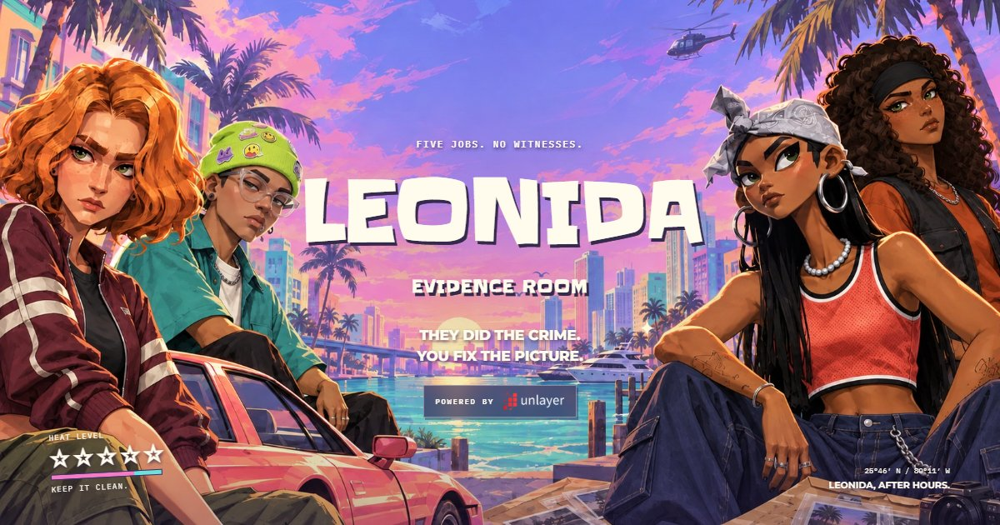
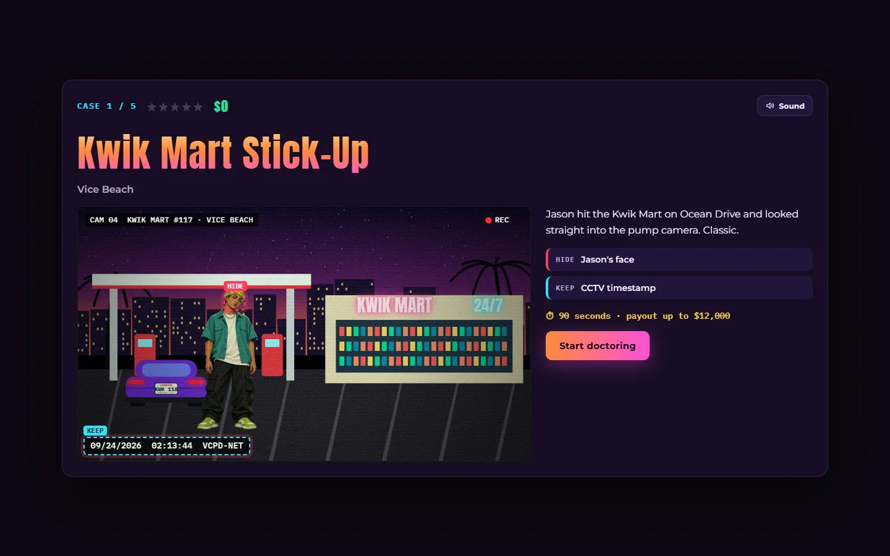
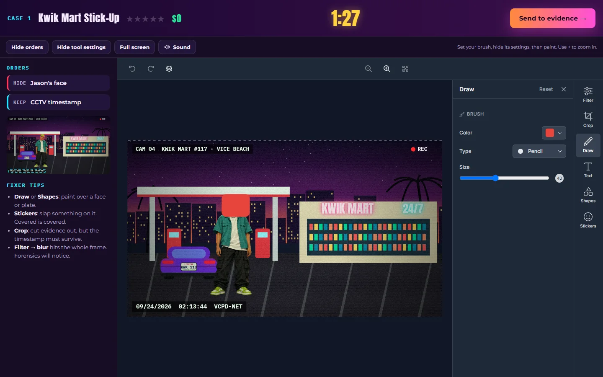
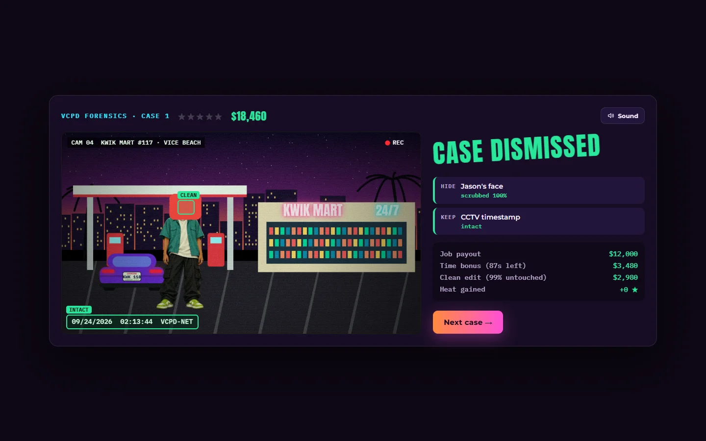
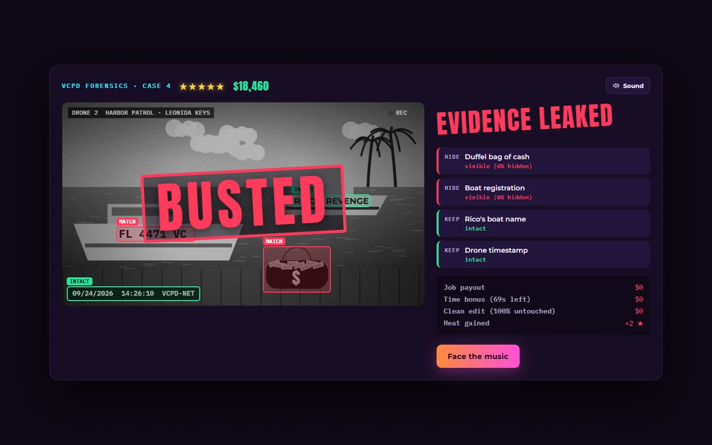
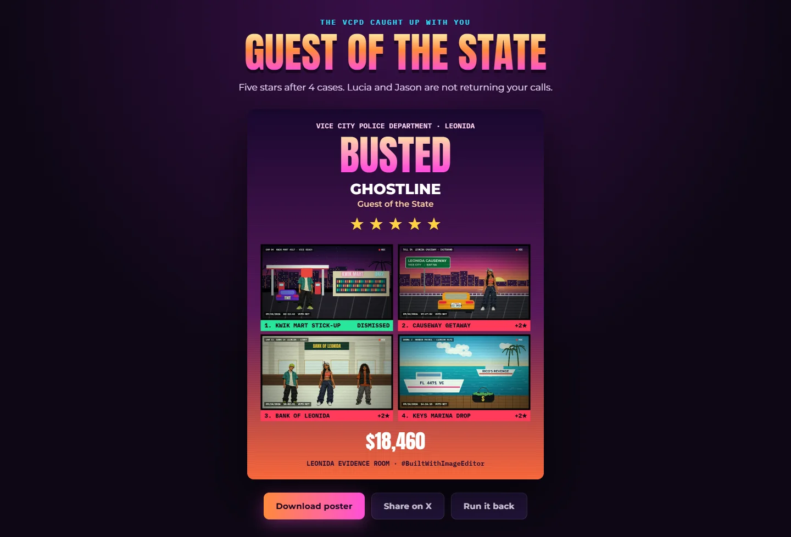
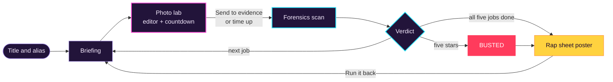

<p align="center">
  
</p>

<h1 align="center">Leonida Evidence Room</h1>

<p align="center">
  <strong>They did the crime. You fix the picture.</strong><br>
  A GTA VI-inspired evidence-doctoring game built on Unlayer's React Image Editor.
</p>

<p align="center">
  <a href="https://github.com/unlayer/react-image-editor"></a>
  
  
  
  <a href="LICENSE"></a>
  
</p>

<p align="center">
  <a href="https://leonida-evidence.vercel.app"><b>▶ Play it live</b></a> ·
  <a href="#how-to-play">How to play</a> ·
  <a href="#the-five-jobs">The five jobs</a> ·
  <a href="#how-it-works">How it works</a> ·
  <a href="#run-it-locally">Run it locally</a> ·
  <a href="#credits-and-licenses">Credits</a>
</p>

Lucia and Jason pulled five jobs across Leonida, and the VCPD has every one on tape. You're the crew's fixer: you get a photo lab, [Unlayer's image editor](https://unlayer.com/image-editor) and a countdown to doctor each CCTV still before forensics runs. Made for the **Build with React Image Editor Challenge**.

<table>
  <tr>
    <td width="50%"><p align="center"><sub><b>Briefing.</b> Each tape marks what to hide and what to keep.</sub></p></td>
    <td width="50%"><p align="center"><sub><b>Photo lab.</b> Doctor the still in Unlayer's editor before time runs out.</sub></p></td>
  </tr>
  <tr>
    <td width="50%"><p align="center"><sub><b>Forensics.</b> Every evidence box comes back CLEAN, MATCH, INTACT or TAMPERED.</sub></p></td>
    <td width="50%"><p align="center"><sub><b>Busted.</b> Five wanted stars and the VCPD catches up.</sub></p></td>
  </tr>
</table>

## Highlights

- **The editor is the game.** Draw, shapes, stickers, text, crop, filters and, where the Unlayer project allows it, the AI Assistant are all tools for making evidence disappear.
- **Five illustrated CCTV tapes** with faces, plates, a tattoo and a bag of cash to hide, and a timestamp you must not touch.
- **Pixel forensics** that line up crops, forgive colour grades and catch whatever is still visible.
- **Heat, payouts and ranks**, ending in a rap-sheet poster you can download and share.
- **Sound, motion and responsive layouts** from phone to widescreen, with a mute button and reduced-motion support.

## How to play

1. **Read the briefing.** Each tape marks the evidence you have to **HIDE** (faces, plates, a tattoo, a bag of cash) and what you must **KEEP** (the timestamp, and Rico's face when you're framing him).
2. **Doctor the still.** Draw over faces, drop shapes or stickers, add text, or crop the evidence out. Filters are allowed, but a global blur also wipes out the timestamp.
3. **Send it to evidence** before the clock runs out. At zero, whatever is on the canvas goes in as it is.
4. **Face forensics.** Every piece of evidence left visible, and every tampered KEEP region, adds a wanted star. Five stars and you're **BUSTED**.
5. **Collect your rap sheet.** Finish all five jobs, or get caught trying, for a poster of your doctored stills, heat and cash.

> [!TIP]
> Need more room to paint? Choose your brush, then **Hide tool settings**: drawing stays active. **Hide orders** frees the sidebar, and **Full screen** expands the workspace without losing your edits. The clock keeps running while you rearrange.

## The five jobs

| # | Job | Location | Clock | Max payout | Hide | Keep |
|:-:|---|---|:-:|--:|---|---|
| 1 | Kwik Mart Stick-Up | Vice Beach | 90 s | $12,000 | Jason's face | CCTV timestamp |
| 2 | Causeway Getaway | Leonida Causeway | 80 s | $18,000 | License plate, Lucia's face | CCTV timestamp |
| 3 | Bank of Leonida | Downtown Vice City | 80 s | $30,000 | Jason's face, Lucia's L+J tattoo | Rico's face, CCTV timestamp |
| 4 | Keys Marina Drop | Leonida Keys | 70 s | $42,000 | Duffel bag of cash, boat registration | Rico's boat name, drone timestamp |
| 5 | Diamond Mile | Vice City Strip | 75 s | $75,000 | Jason's face, Lucia's face, license plate | Rico's face, CCTV timestamp |

### Scoring

| Ledger line | How it's earned |
|---|---|
| **Job payout** | The job's payout, times the share of HIDE targets you scrubbed |
| **Time bonus** | $40 for every second left on the clock, times the same share |
| **Clean edit** | 25% of the payout, times how much of the rest of the frame you left untouched. Only paid with zero heat |
| **Heat** | One wanted star for each piece of visible evidence or tampered KEEP region |

Your rank on the rap sheet: **Ghost of Leonida** (no stars), **Vice City Fixer** (one or two), **Sloppy Accomplice** (three or four) or **Guest of the State** (busted).

<p align="center">
  
</p>

## How it works



### The image editor

The editor is the core mechanic, not decoration:

| Editor API | What the game does with it |
|---|---|
| `<ImageEditor image>` | Loads each generated CCTV still as a data URL. |
| `options.features.imageEditor.tools` | Turns off Resize and Frame, so exports stay comparable with the original tape. |
| `options.projectId` and `features.ai` | Enables Unlayer's AI Assistant for projects entitled to it. |
| `editor.getImage()` | Exports the doctored still when you send it to evidence or the clock hits zero. Any open tool panel is closed first, because filter and crop changes only commit when their panel closes. |
| `onSave` and `onCancel` | The editor's own Save and Cancel buttons are hidden during a case, so **Send to evidence** is the only way to hand in a tape. Both callbacks stay wired as a fallback: Save submits, and Cancel resets the tape through `editor.reset()`. |

### Forensics engine

[`src/forensics.js`](src/forensics.js) scores the doctored still against the original tape in three steps:

1. **Alignment.** A coarse-to-fine search finds where a cropped export sits inside the original frame.
2. **Colour fit.** A robust least-squares colour transform means brightness, contrast or sepia filters alone don't count as tampering.
3. **Cell inspection.** Each evidence box is split into 8×8 cells. A cell counts as hidden if it was painted over, covered, cropped away, or lost more than half of its detail to blur. Only cells that carry detail are judged.

The verdict screen then replays the check box by box, and a scrubbed face comes back **CLEAN** while a visible one is a **MATCH**.

### Scenes and art

All five environments are drawn procedurally on canvas by [`src/scenes.js`](src/scenes.js): the Vice Beach gas station, the Leonida Causeway, the Bank of Leonida, the Keys marina and the Diamond Mile. They are finished with illustrated character sprites and a CCTV grain, scanline and timestamp overlay. [`src/avatars.js`](src/avatars.js) maps each face and Lucia's tattoo into scene coordinates, so the forensics targets line up with the art.

The illustrations were generated for this project from the author's character references. [`artwork/`](artwork/ARTWORK.md) keeps the source PNGs and their prompts, and `node scripts/optimize-art.mjs` turns them into the three WebP files in `public/art/`. The homepage's "Powered by Unlayer" badge and footer credit use Unlayer's official white wordmark, resized to `public/brand/unlayer-logo-white.webp`.

### Sound

[`src/sound.js`](src/sound.js) plays seven effects from Kenney's CC0 packs:

- a shutter when a tape goes to evidence
- a tick through the last ten seconds
- a blip for each evidence box as forensics checks it
- a stamp, or a jail-door clang, when the verdict lands
- coins on the payout

The files are WAV because Safari can't decode OGG. The **Sound** button on the briefing, lab and verdict screens mutes them and remembers the choice.

### Project structure

```text
src/
├── App.jsx        Screen flow, photo lab, verdict and rap sheet, scoring
├── Home.jsx       Animated landing page and alias form
├── scenes.js      The five CCTV scenes and their evidence targets
├── avatars.js     Sprite atlas mapping for faces and the tattoo
├── forensics.js   Compares the doctored still with the original tape
├── rapsheet.js    Draws the shareable end-of-run poster
└── sound.js       Sound effects and the mute setting
public/            Art, fonts, sounds, icons, social card and credits
artwork/           Source illustrations and their generation prompts
docs/screenshots/  Images used in this README
scripts/           Playwright test suites and asset scripts
```

## Run it locally

You need Node 24 LTS (22.12 or newer) and an internet connection, because the image editor loads from Unlayer's CDN.

```sh
npm ci
npm run dev
```

## Deploy

This is a static Vite app with no backend or private environment variables. Run `npm ci`, then `npm run check`, and deploy only `dist/` at the site's root path. Vercel and Netlify settings are included in `vercel.json` and `netlify.toml`, and both cache the fingerprinted files in `/assets/` for a year. Every build also writes `third-party-licenses.txt` with the license of each bundled library.

> [!IMPORTANT]
> The public Unlayer project ID is set in `src/App.jsx`. Check the project's domain restrictions and AI entitlement in your Unlayer account for the final hostname. Drawing, crop, shapes, text and scoring work without AI, and no API secret belongs in the browser bundle.

Link previews show `public/social-card.jpg` and need its absolute URL. Netlify and Vercel builds pick up the production address automatically. On any other host, set `SITE_URL` when building, for example `SITE_URL=https://example.com npm run build`. After changing the favicon or the hero, start the dev server and run `node scripts/brand-assets.mjs` to regenerate the social card and `public/apple-touch-icon.png`.

## Tests

Run `npm run check` (lint and build), then start `npm run preview -- --host 127.0.0.1 --port 5201` for the production suites. For the last three suites, start `npm run dev -- --host 127.0.0.1 --port 5200` instead.

| Command | Server | What it covers |
|---|---|---|
| `npm run test:release` | Preview, port 5201 | The production build with a deterministic editor double: five clean jobs, poster download, replay, recovery from loading, export and analysis failures, mobile layout, countdown expiry, sound files and the mute setting |
| `node scripts/release-live.mjs` | Preview, port 5201 | The real hosted editor: three jobs to a bust, the BUSTED stamp, poster download and the mobile editor. Needs network access |
| `npm run test:workspace` | Preview, port 5201 | The live editor at three widths: collapsed tool settings, drawing, full screen, tall panels and filters that are still open when you submit |
| `npm run test:home` | Dev, port 5200 | The landing page at four widths and with reduced motion, plus the `/#play` deep link |
| `npm run test:responsive` | Dev, port 5200 | Every screen, played through to a bust, on phones in both orientations, a tablet and a desktop: no sideways overflow, no covered controls, 44px touch targets, no text under 9px, and the hero's call to action on the first screen |
| `npm run test:avatars` | Dev, port 5200 | Scene art and forensic scoring for all five jobs |

Set `HOME_TEST_URL` to point a suite at another server, and `BROWSER_CHANNEL=chrome` to test in Chrome instead of Microsoft Edge.

> [!NOTE]
> Before sharing a deployed link, run the live suite with `HOME_TEST_URL` set to that link, then check the first edit, submission, poster download and, if enabled, the AI tools on that domain. `lab.html`, the source PNGs, test screenshots and reference videos are not part of the build.

## Credits and licenses

The game's source code is released under the [MIT License](LICENSE). Third-party work keeps its own license; [CREDITS.md](CREDITS.md) lists every library, font and sound, and the deployed site serves the same list at `/credits.txt`.

| Asset | By | License |
|---|---|---|
| Image editor and React wrapper | [Unlayer](https://unlayer.com) | Unlayer's terms; wrapper under MIT |
| React and React DOM | Meta | MIT |
| Slackey | Sideshow | Apache 2.0 |
| Anton, IBM Plex Mono and Montserrat | Vernon Adams; IBM; Julieta Ulanovsky and contributors | SIL Open Font License 1.1 |
| Sound effects | [Kenney](https://kenney.nl) | CC0 1.0 |

> [!NOTE]
> Leonida Evidence Room is an unofficial fan project. Grand Theft Auto and Rockstar Games are trademarks of Take-Two Interactive Software, Inc., and this project is not affiliated with or endorsed by Rockstar Games or Take-Two. The Unlayer name and logo belong to Unlayer and appear only to credit the editor.

<p align="center"><sub>Made by timidanx for the Build with React Image Editor Challenge · #BuiltWithImageEditor</sub></p>
